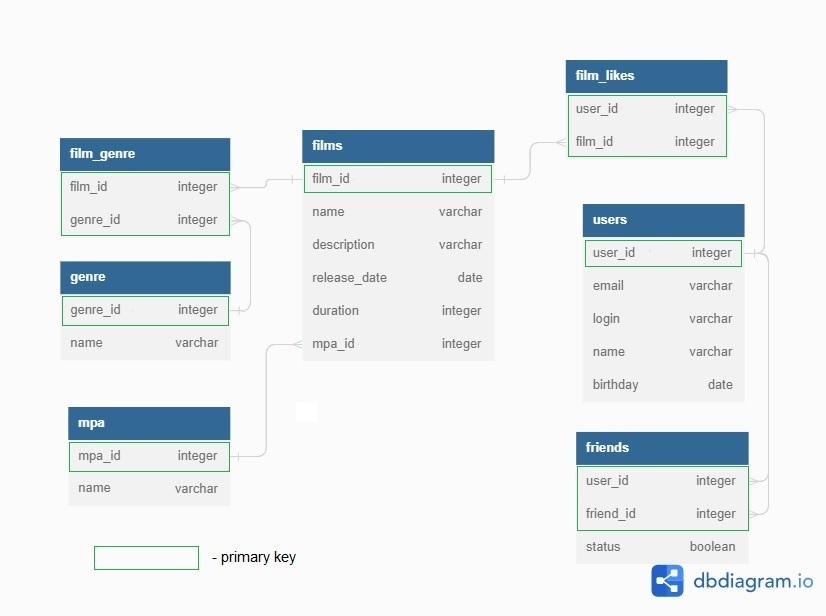

# java-filmorate
Template repository for Filmorate project.

### Примеры запросов:
#### 1. Получение списка всех фильмов:

    SELECT *

    FROM films;

#### 2. Получение пользователя по id:

      SELECT *

      FROM users

      WHERE user_id = 1;

#### 3. Получение списка топ-5 фильмов по популярности:

      SELECT f.*, m.name AS mpa_name
      FROM films AS f
      JOIN mpa AS m ON f.mpa_id = m.mpa_id
      LEFT JOIN (SELECT film_id, COUNT(user_id) AS likes_count
                 FROM film_likes
                 GROUP BY film_id
                 ORDER BY likes_count) AS popular ON f.film_id = popular.film_id
      ORDER BY popular.likes_count
      DESC limit 5;

### Пояснения к диаграмме:
#### 1. Таблица films:

   film_id - ID фильма (Первичный ключ)
   
   name - Название фильма
   
   description - Описание фильма

   duration - Длительность фильма

   release_date - Дата выхода фильма

   mpa_id - Уникальный ключ . ID Рейтинга фильма
   

#### 2. Таблица film_genre:

   film_id - ID фильма (Внешний ключ)

   genre_id - ID жанра (Внешний ключ)
   
   Поля film_id и genre_id составляют первичный ключ.

#### 3. Таблица film_likes:

   user_id - ID пользователя (Внешний ключ)

   film_id - ID фильма (Внешний ключ)
   
   Поля user_id и film_id составляют первичный ключ.

#### 4. Таблица friends:

   user_id - ID пользователя (Внешний ключ)

   friend_id - ID друга пользователя (Внешний ключ)

   status - статус дружбы
   
   Поля user_id и friend_id составляют первичный ключ.

#### 6. Таблица genre:

   genre_id - ID жанра фильма (Первичный ключ)

   name - жанр фильма

#### 7. Таблица mpa:

   mpa_id - ID Рейтинга фильма (Первичный ключ)

   name - Рейтинг фильма. Значения могут быть следующими:

   - G — у фильма нет возрастных ограничений,

   - PG — детям рекомендуется смотреть фильм с родителями,

   - PG-13 — детям до 13 лет просмотр не желателен,

   - R — лицам до 17 лет просматривать фильм можно только в присутствии взрослого,

   - NC-17 — лицам до 18 лет просмотр запрещён.
   

#### 8. Таблица users:

   user_id - ID пользователя (Первичный ключ)

   email - Почтовый адресс пользователя

   name - Имя пользователя

   login - Логин пользователя

   birthday - Дата рождения пользователя

 
